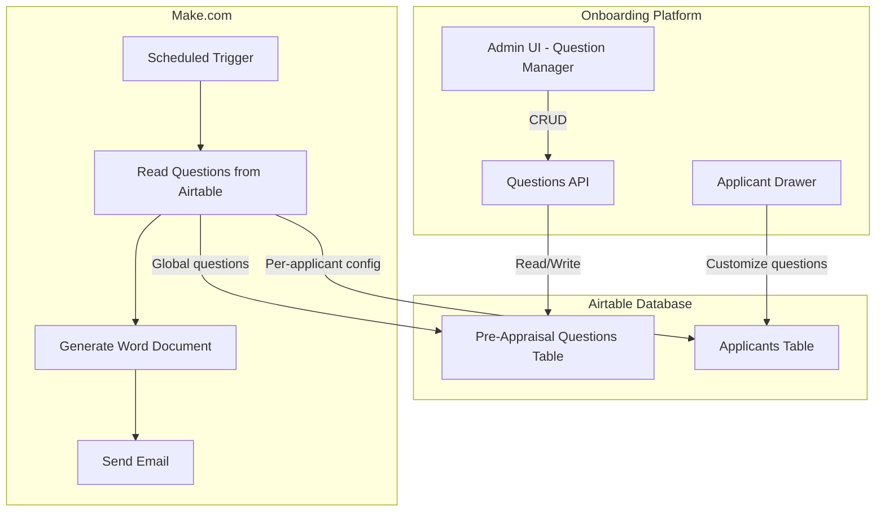

# Custom Pre-Appraisal Questions Feature

## Overview

Enable admins to create, manage, and customize pre-appraisal questions through the platform. Questions will be stored in Airtable and consumed by Make.com to generate personalized Word documents sent via email.

---

## Architecture



---

## Database Schema Changes (Airtable)

### New Table: Pre-Appraisal Questions

| Field Name | Type | Description |

|------------|------|-------------|

| ID | AutoNumber | Primary key |

| Question | Single Line Text | The question text |

| Section | Single Select | Category: `Performance`, `Goals`, `Development`, `Feedback`, `General` |

| Order | Number | Display/document order within section |

| Is Default | Checkbox | If true, included in all appraisals by default |

| Is Active | Checkbox | Soft delete - inactive questions are hidden |

| Created At | Created Time | Audit timestamp |

| Created By | Link to Staff | Who created the question |

**Proposed Table ID**: You will need to create this table in Airtable manually.

**Suggested section choices** (based on typical appraisal forms):

- `selPerfReview` - "Performance Review"
- `selGoalsSetting` - "Goals and Objectives"
- `selDevelopment` - "Professional Development"
- `selFeedback` - "Feedback and Communication"
- `selGeneral` - "General"

### Applicants Table - New Field

| Field Name | Type | Description |

|------------|------|-------------|

| Pre-Appraisal Questions Config | Multiline Text | JSON storing per-applicant question customization |

**JSON Structure:**

```json
{
  "useDefaults": true,
  "excludedQuestionIds": ["rec123", "rec456"],
  "additionalQuestionIds": ["rec789"],
  "customQuestions": [
    {
      "id": "custom_1",
      "question": "What specific challenges did you face with the new software?",
      "section": "Performance Review"
    }
  ],
  "updatedAt": "2026-01-18T10:00:00.000Z",
  "updatedBy": "recStaffId123"
}
```

---

## UI Components

### 1. Global Questions Manager (New Page)

**Location**: `/admin/settings/appraisal-questions` (new route)

**Features**:

- List all global pre-appraisal questions grouped by section
- Create new questions with section assignment
- Edit existing questions inline
- Toggle `Is Default` status
- Reorder questions via drag-and-drop or order field
- Soft delete (set `Is Active` to false)

**Access**: Admin only

### 2. Per-Applicant Question Customization (Applicant Drawer Enhancement)

**Location**: Within existing Appraisals section in [`components/admin/users/applicant-drawer.js`](components/admin/users/applicant-drawer.js)

**Trigger**: New "Customize Questions" button near the "Set Date" button

**Modal Features**:

- Show all default questions (checkboxes to include/exclude)
- Section to add additional global questions not marked as default
- Section to add custom one-off questions for this applicant
- Preview of final question list
- Save configuration to `Pre-Appraisal Questions Config` field

---

## API Endpoints

### New Endpoints

| Method | Endpoint | Description |

|--------|----------|-------------|

| GET | `/api/admin/appraisal-questions` | List all active questions (grouped by section) |

| POST | `/api/admin/appraisal-questions` | Create a new global question |

| PATCH | `/api/admin/appraisal-questions/[id]` | Update a question |

| DELETE | `/api/admin/appraisal-questions/[id] `| Soft delete (set `Is Active` = false) |

| GET | `/api/admin/users/[id]/appraisal-questions` | Get resolved questions for an applicant |

| POST | `/api/admin/users/[id]/appraisal-questions` | Save per-applicant question config |

### Question Resolution Logic

When Make.com (or the preview UI) needs the final question list for an applicant:

```javascript
function resolveQuestionsForApplicant(globalQuestions, applicantConfig) {
  const config = applicantConfig || { useDefaults: true };
  const excludedIds = new Set(config.excludedQuestionIds || []);
  
  // Start with default questions (minus exclusions)
  let questions = globalQuestions
    .filter(q => q.isDefault && q.isActive && !excludedIds.has(q.id))
    .sort((a, b) => a.order - b.order);
  
  // Add additional global questions
  if (config.additionalQuestionIds?.length) {
    const additionalSet = new Set(config.additionalQuestionIds);
    const additional = globalQuestions
      .filter(q => additionalSet.has(q.id) && q.isActive);
    questions = [...questions, ...additional];
  }
  
  // Add custom questions
  if (config.customQuestions?.length) {
    questions = [...questions, ...config.customQuestions];
  }
  
  // Group by section for document generation
  return groupBySection(questions);
}
```

---

## Make.com Integration Changes

### Current Flow (from provided blueprint)

1. Search Applicants with `NOT({Appraisal Date} = BLANK())`
2. Calculate days difference
3. At 14 days: Get static document, send email

### Updated Flow

1. Search Applicants with `NOT({Appraisal Date} = BLANK())`
2. Calculate days difference  
3. At 14 days before:

   - **NEW**: Read `Pre-Appraisal Questions Config` from applicant record
   - **NEW**: Fetch global questions from `Pre-Appraisal Questions` table
   - **NEW**: Resolve final question list using logic above
   - **UPDATED**: Generate Word document with dynamic questions (using variables)
   - Send email with attachment

### Make.com Variables for Word Document

The Word document template should include merge fields:

```
{{Section_Performance_Questions}}
{{Section_Goals_Questions}}
{{Section_Development_Questions}}
{{Section_Feedback_Questions}}
{{Section_General_Questions}}
```

Make.com will populate each section with numbered questions:

```
1. How would you rate your performance this year?
2. What achievements are you most proud of?
3. ...
```

---

## Implementation Tasks

### Phase 1: Database Setup

- Create `Pre-Appraisal Questions` table in Airtable
- Add `Pre-Appraisal Questions Config` field to Applicants table
- Seed initial default questions (based on existing Word doc questions)

### Phase 2: Backend APIs  

- Implement CRUD endpoints for global questions
- Implement per-applicant question config endpoints
- Add question resolution logic

### Phase 3: Admin UI - Global Questions Manager

- Create new settings page for question management
- Implement question list with section grouping
- Add create/edit/delete functionality
- Add drag-and-drop reordering

### Phase 4: Applicant Drawer Enhancement

- Add "Customize Questions" button
- Build question customization modal
- Implement preview functionality
- Save configuration on appraisal date set

### Phase 5: Make.com Updates

- Update scenario to read from new questions table
- Implement question resolution logic in Make.com
- Update Word document template with merge fields
- Test end-to-end flow

---

## Clarifications Needed from You

1. **Word Document Template**: Do you have access to modify the Google Docs template (`1_im0kwJTQixGSctg_CVGxw0D_4IN0Asco1FaFZ77NKo`)? The template needs merge fields for dynamic questions.

2. **Initial Questions**: What are the current standard questions in the pre-appraisal form? I can help seed them into the new table.

3. **Navigation**: Should the Global Questions Manager be:

   - A new page under Settings (`/admin/settings/appraisal-questions`)
   - Or accessible from the existing sidebar?

4. **Section Categories**: Are the proposed sections (Performance, Goals, Development, Feedback, General) appropriate, or should they match specific sections in your current Word document?

---

## Files to Create/Modify

| File | Action | Purpose |

|------|--------|---------|

| `src/app/admin/settings/appraisal-questions/page.js` | Create | Global questions manager page |

| `src/app/api/admin/appraisal-questions/route.js` | Create | CRUD API for global questions |

| `src/app/api/admin/appraisal-questions/[id]/route.js` | Create | Single question operations |

| `src/app/api/admin/users/[id]/appraisal-questions/route.js` | Create | Per-applicant question config |

| `components/admin/users/applicant-drawer.js` | Modify | Add question customization UI |

| `components/admin/settings/AppraisalQuestionsManager.js` | Create | Questions management component |

| `docs/custom-appraisal-questions.md` | Create | Feature documentation |