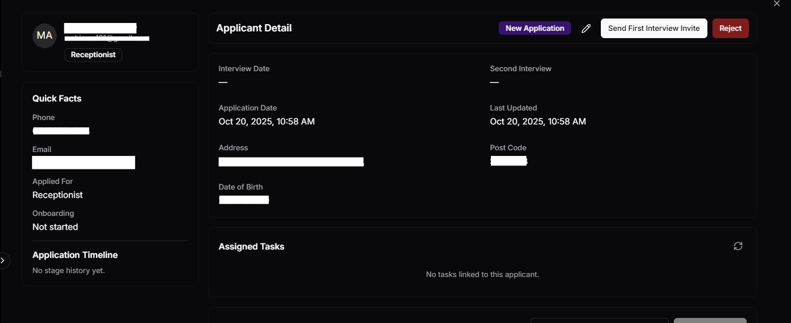
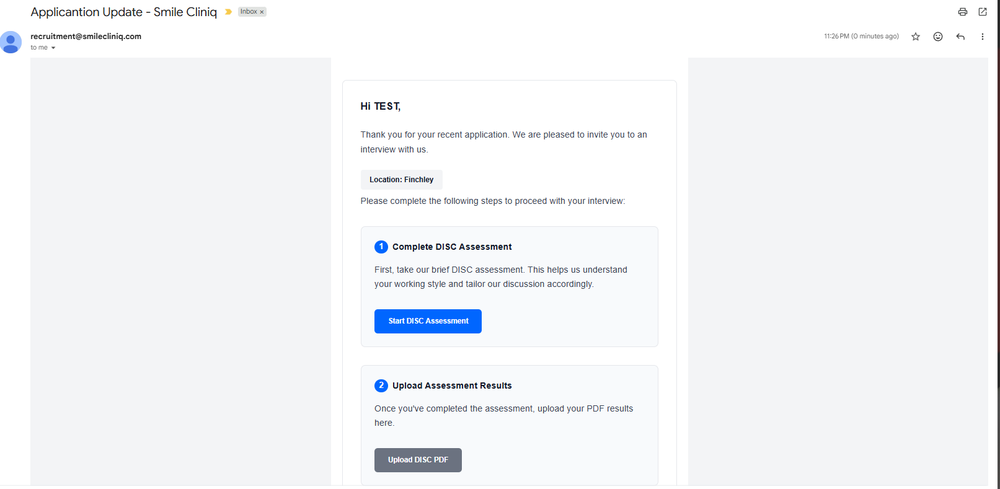
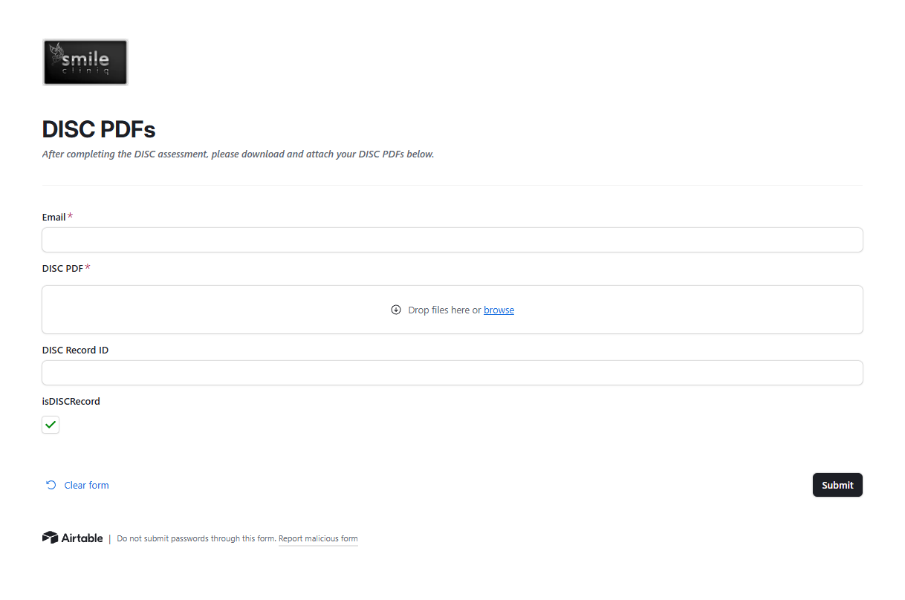
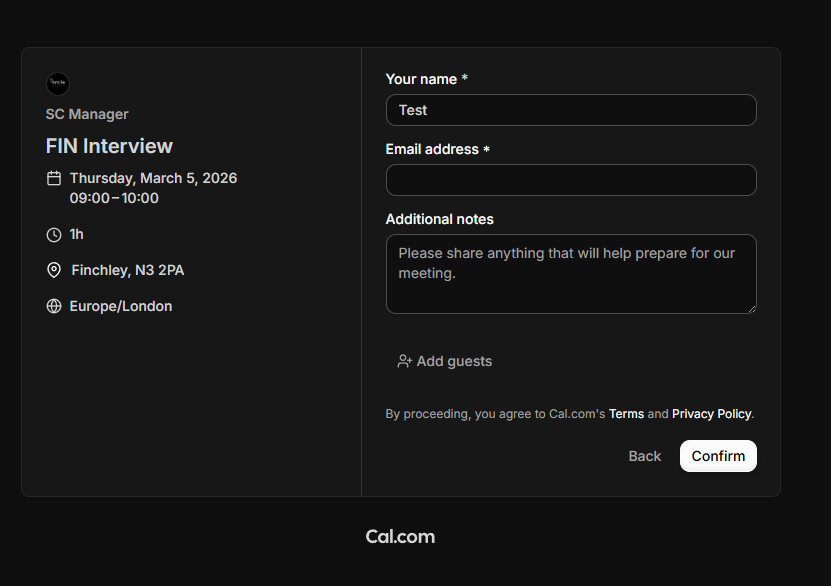
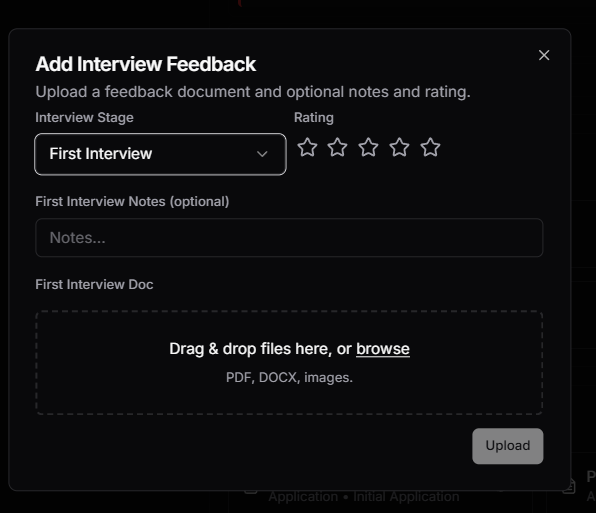

# Hiring Guide

_Last updated: February 2026_

This guide covers the Application Tracking System (ATS) — the system used to manage job candidates from first application through to being hired.

> **Note:** While candidate data lives in Airtable, all stage changes are made through the **Onboarding Task Manager platform** (`/admin/users`). You do not need to edit Airtable records directly.

---

## 1. The Hiring Pipeline (Stages)

Candidates move through these stages. Some transitions trigger automatic emails.

```
New Application
      ↓
First Interview Invite Sent  ──── (auto: sends 3-step interview invite email)
      ↓
First Interview Booked
      ↓
Reviewed                     ──── (auto: set when interviewer submits feedback form)
      ↓
Second Interview Invite Sent ──── (auto: sends second interview invite email)
      ↓
Second Interview Booked
      ↓
Reviewed (2nd)               ──── (auto: set when 2nd feedback submitted, records merged)
      ↓
Hired                        ──── (auto: sends welcome email + new starter docs + notifies managers)
      │
      ├─ Rejected             ──── (auto: sends rejection email to candidate)
      └─ Rejected - Liked     ──── (auto: sends softer "thank you" email, keeps candidate on file)
```

### What happens automatically at each stage

| Stage you set | What fires automatically |
|---|---|
| **First Interview Invite Sent** | Make.com sends the candidate a 3-step email: (1) DISC assessment link, (2) personalised DISC PDF upload form, (3) Cal.com interview booking link |
| **Second Interview Invite Sent** | Make.com sends the candidate a second interview invite with a Cal.com booking link |
| **Reviewed / Reviewed (2nd)** | Set automatically when the interviewer submits their feedback form — you don't set this manually |
| **Hired** | Make.com sends the candidate a welcome email with "Welcome to Smile Cliniq" PDF and "New Starter Document Form" attached. Separately, `managers@smilecliniq.com` is notified to set the onboarding start date |
| **Rejected** | Make.com sends a rejection email to the candidate (Subject: "Smile Cliniq Application Update") |
| **Rejected - Liked** | Make.com sends a softer "thank you" email to the candidate, noting you'd like to keep their information on file for future roles (Subject: "Thank You for Your Application") |

---

## 2. Moving a Candidate Through Stages

All stage changes are made through the platform, not directly in Airtable.

1. Log in to the platform at `https://onboarding-task-manager.vercel.app`
2. Go to **Admin → Users**
3. Find the candidate
4. Change their stage

The Airtable automation fires automatically when the stage is updated.

> 
> 

### Before setting "First Interview Invite Sent"

Only one thing needs to be set on the candidate's record first:

- **Interview Location** — which branch they'll interview at (used to personalise the Cal.com booking URL)

The interviewer is assigned automatically based on the job role. You do not need to set it manually.

If Interview Location is missing, Make.com will fall back to a generic Cal.com link.

### Before setting "Hired"

No manual steps required. When you mark a candidate as Hired through the platform, the "Onboarding Manual Import" field is handled automatically.

---

## 3. The Interview Process

### DISC Assessment
When a first interview invite is sent, the candidate receives a 3-step email:
1. Complete the DISC personality assessment at tonyrobbins.com/disc
2. Upload their DISC PDF results via a personalised Airtable form (pre-filled with their email)
3. Book their interview time via their personalised Cal.com link

> 
> 
> 

### Cal.com Booking Links
Each interviewer has two Cal.com links stored in the Staff table:
- **Cal Link - First Interview**
- **Cal Link - Second Interview**

Make.com appends the branch location slug to these links, so bookings are routed to the correct branch.

### Feedback Forms
After each interview, the interviewer submits a Feedback Form through the platform (`/admin/users page`). The form captures their assessment and score.

**What happens automatically:**
- First Interview feedback submitted → candidate stage changes to **Reviewed**
- Second Interview feedback submitted → candidate stage changes to **Reviewed (2nd)**, and both feedback records are merged into one

> 

---

## 4. Document Collection

### New Starter Documents (Post-Hire)
When a candidate is marked as **Hired**, they receive an email with:
- "Welcome to Smile Cliniq" PDF (attached)
- "SC New Employee Starter Forms" PDF (attached)
- A link to the **New Starter Document Form** (Airtable form for right-to-work documents, personal details, etc.)

### Document Submission Processing
When a candidate submits the document form:
1. A new record is created in the **Documents** table in Airtable
2. The system automatically links it to the matching candidate record by email
3. A Make.com scenario (`RECEIVED_JOB_DOCUMENTS`) processes the submission

---

## 5. The Jobs Table

Job postings are managed in the **Jobs** table in Airtable. Each job record contains:

| Field | What it is |
|---|---|
| **Title** | Job title (e.g. Dentist, Nurse, Receptionist, Manager) |
| **Job Status** | Active / Inactive |
| **Description** | Role description |
| **Interviewers** | Linked to Staff — who interviews for this role (used to auto-assign interviewer to new applicants) |

---

## 6. Adding a Candidate Manually (Existing Staff)

If you need to add an existing staff member directly to the onboarding platform (bypassing the hiring pipeline):

1. Go to **Admin → Users** in the platform
2. Use the manual import function to add the candidate
3. The platform automatically marks the record with "Onboarding Manual Import" — this prevents automated hiring emails from firing
4. You can then start their onboarding from the admin panel

> **Note:** The "Onboarding Manual Import" checkbox is set automatically by the platform. You do not need to set it yourself in Airtable.

---

## 7. Troubleshooting

**Interview invite email not sent after changing stage**
- Check that **Interview Location** is set on the candidate record
- Check Make.com — open the "Send First Interview Invite" scenario and check its execution history for errors

**Candidate not receiving emails**
- Verify their email address is correct (no typos, no spaces)
- Check Gmail sent items for `recruitment@smilecliniq.com`
- Check Make.com execution history for the relevant scenario

**Stage not updating after feedback form submission**
- Check the Airtable automation "Feedback Submission" in the Change Stage group
- Ensure the feedback form's "Interview Stage" field was filled in correctly (must be exactly "First Interview" or "Second Interview")

**Candidate marked Hired but no manager notification received**
- Check Make.com "Changes in Status" scenario execution history
- Verify the candidate's email address was set correctly on their record
