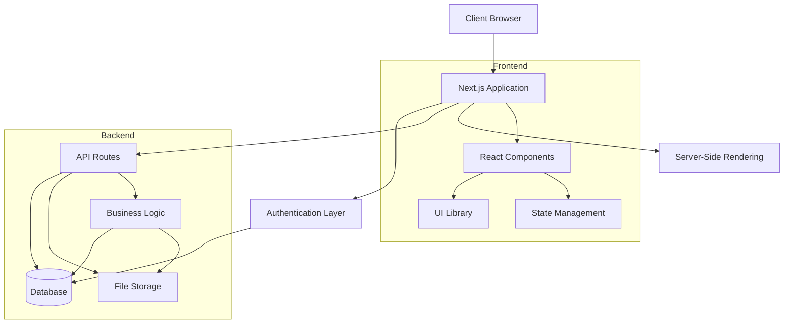
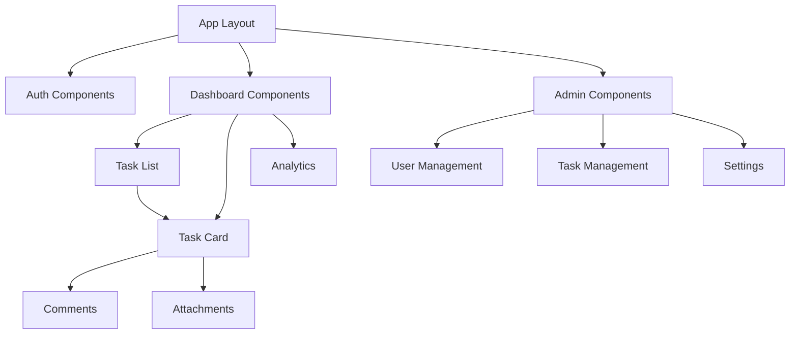
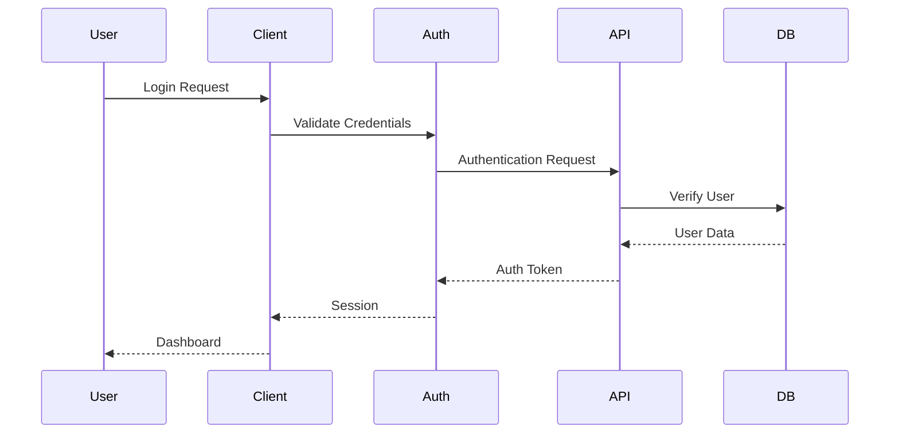
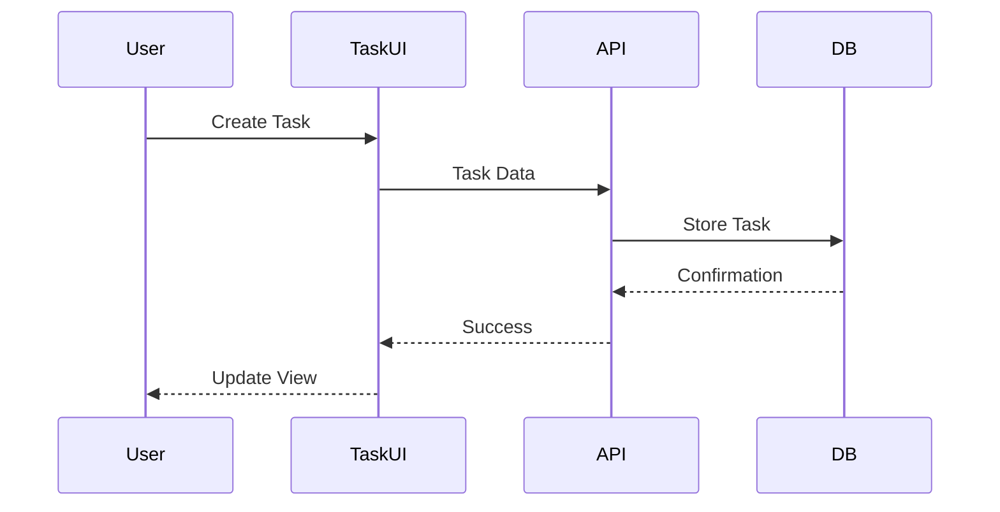

# Technical Architecture Documentation

## System Architecture Overview

## Component Architecture

### Frontend Components

## Data Flow

### Authentication Flow

### Task Management Flow

## Security Architecture

### Authentication & Authorization
- JWT-based authentication
- Role-based access control (RBAC)
- Session management
- Secure password handling

### Data Protection
- Input validation
- XSS prevention
- CSRF protection
- SQL injection prevention
- File upload security

## Performance Architecture

### Caching Strategy
- Browser caching
- API response caching
- Static page generation
- Dynamic page optimization

### Load Optimization
- Code splitting
- Lazy loading
- Image optimization
- Bundle optimization

## Deployment Architecture

### Production Environment
- Next.js server
- Database server
- File storage
- CDN
- Load balancer

### Development Environment
- Local development server
- Development database
- Mock services
- Testing environment

## Monitoring & Logging

### System Monitoring
- Server health checks
- Performance metrics
- Error tracking
- User analytics

### Logging Strategy
- Application logs
- Error logs
- Access logs
- Audit logs

## Backup & Recovery

### Backup Strategy
- Database backups
- File system backups
- Configuration backups
- Regular snapshots

### Recovery Procedures
- Data restoration
- System recovery
- Disaster recovery
- Business continuity

---

This architecture documentation provides a high-level overview of the system's technical design. For specific implementation details, please refer to the [features documentation](./features.md) and [changelog](./changelog/README.md). 