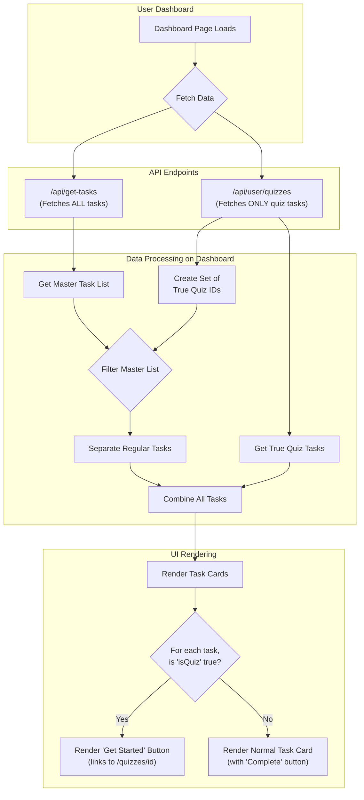
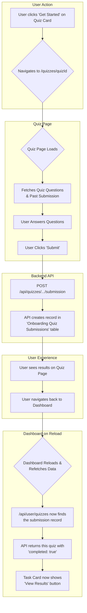

# Smile Clinique Onboarding Task Manager - Features & Architecture Documentation

## Table of Contents
1. [System Overview](#system-overview)
2. [User Roles & Authentication](#user-roles--authentication)
3. [Core Features](#core-features)
4. [Page Structure](#page-structure)
5. [Component Architecture](#component-architecture)
6. [Technical Implementation](#technical-implementation)

## System Overview

The Smile Clinique Onboarding Task Manager is a comprehensive web application designed to streamline the onboarding process for dental clinics. Built with Next.js 13+ and modern web technologies, it provides a robust platform for managing tasks, users, and clinic onboarding workflows.

### Key Objectives
- Streamline clinic onboarding process
- Manage and track onboarding tasks
- Provide role-based access control
- Enable efficient communication between stakeholders
- Maintain comprehensive audit trails

## User Roles & Authentication

### Authentication System
- Secure login system with email/password
- Password reset functionality
- Session management
- Protected routes and API endpoints

### User Roles
1. **Admin**
   - Full system access
   - User management
   - Task template creation
   - System configuration

2. **Clinic Manager**
   - Clinic-specific task management
   - Team member management
   - Progress tracking
   - Report generation

3. **Team Members**
   - Task execution
   - Progress updates
   - Document submission
   - Communication

## Core Features

### 1. Task Management
- **What:** Create, assign, track, and complete onboarding tasks
- **Who:** Admins, Managers, Team Members
- **Example:** Admin assigns a checklist to a new hire; team member marks tasks as complete; manager reviews progress

### 2. Dashboard & Analytics
- **What:** Visual overview of onboarding status, completion rates, overdue tasks, and team performance
- **Who:** Admins, Managers
- **Example:** Manager views dashboard to see which hires are behind schedule

### 3. Document Management
- **What:** Upload, categorize, and review onboarding documents
- **Who:** Team Members (upload), Admins/Managers (review)
- **Example:** New hire uploads ID; admin verifies and marks as received

### 4. Calendar & Scheduling
- **What:** Schedule onboarding events, meetings, and deadlines (Google Calendar integration)
- **Who:** Admins, Managers
- **Example:** Manager schedules orientation session; team receives calendar invite

### 5. Communication & Notifications
- **What:** Internal messaging, task comments, and real-time notifications (toast system)
- **Who:** All users
- **Example:** Team member comments on a task; admin receives notification

### 6. Audit Logging & Compliance
- **What:** All key actions are logged for compliance and troubleshooting
- **Who:** Admins (view logs)
- **Example:** Admin reviews audit log to see who completed a task

### 7. Role-Based Access Control
- **What:** Different permissions for Admin, Manager, Team Member
- **Who:** All users
- **Example:** Only admins can create templates; team members can only see their own tasks

### 8. Onboarding Quiz Feature
- **What:** Assign, deliver, and score onboarding quizzes as part of the applicant onboarding journey.
- **Who:** Admins (create/assign), Applicants (take quizzes).
- **Example:** An applicant is assigned a weekly knowledge quiz, completes it via their dashboard, and receives instant feedback on their score and pass/fail status.

---

#### **Detailed Breakdown of Quiz Functionality**

The quiz system is designed to be robust but requires a specific data flow to distinguish quiz tasks from regular tasks. This section provides a comprehensive overview of that flow, from data creation to user interaction.

##### **Onboarding Quiz Scoring Logic**

This document explains how scores are calculated for the onboarding quizzes, particularly for questions that allow for multiple answers (checkboxes). Our goal is to have a scoring system that is both fair and accurate, rewarding knowledge while discouraging random guessing.

**Single-Answer Questions (Radio Buttons)**

These are the most straightforward question types.

*   **Scoring Method:** All-or-nothing.
*   **Logic:** If the user selects the correct answer, they receive the full points allocated to that question. If they select any other answer, they receive zero points.

**Multiple-Answer Questions (Checkboxes)**

For questions where multiple answers can be selected, we use a more nuanced approach called **Partial Credit with Penalty**. This system rewards users for each correct answer they select but subtracts points for any incorrect answers they choose.

**The Formula**

The score for a checkbox question is calculated in three steps:

1.  **Calculate the Value of Each Correct Option:** We take the total points available for the question and divide it by the number of correct answers.
    *   `Value per Option = (Total Points for the Question) / (Number of Correct Answers)`

2.  **Calculate the Score:** We add up the value for each correct answer selected and subtract the value for each incorrect answer selected.
    *   `Your Score = (Number of Correct Answers You Chose * Value per Option) - (Number of Incorrect Answers You Chose * Value per Option)`

3.  **Final Score:** The score for a question cannot be negative. If the calculation results in a negative number, the final score for that question will be **0**.

**Worked Examples**

Let's walk through two scenarios to see how this works in practice.

**Example 1: User Selects Correct and Incorrect Answers**

*   **Question:** "Who provides dental implant treatment?"
*   **Total Points:** 2
*   **Correct Answers (2):** `Dr Ravinder Varaich`, `Dr Sarah Bux`
*   **User Selection:** `Dr Ravinder Varaich` (Correct), `Dr Chetan Kaher` (Incorrect)

1.  **Value per Option:** `2 points / 2 correct answers` = **1 point per option**.

2.  **Calculate Score:**
    *   Correct selections: 1 (`Dr Ravinder Varaich`)
    *   Incorrect selections: 1 (`Dr Chetan Kaher`)
    *   `(1 * 1 point) - (1 * 1 point)` = **0 points**.

3.  **Final Score:** The user scores **0 points** for this question.

**Example 2: User Selects All Correct Answers**

*   **Question:** "Which of these are cosmetic treatments?"
*   **Total Points:** 3
*   **Correct Answers (3):** `Veneers`, `Whitening`, `Crowns`
*   **User Selection:** `Veneers` (Correct), `Whitening` (Correct), `Crowns` (Correct)

1.  **Value per Option:** `3 points / 3 correct answers` = **1 point per option**.

2.  **Calculate Score:**
    *   Correct selections: 3
    *   Incorrect selections: 0
    *   `(3 * 1 point) - (0 * 1 point)` = **3 points**.

3.  **Final Score:** The user scores the full **3 points** for this question.

**How to Achieve "One Point Per Answer"**

If you want each correct answer to be worth exactly one point, simply set the **Total Points** for the question in Airtable to be equal to the **number of correct answers**.

For instance, if a question has 3 correct answers, setting the question's `Points` to 3 will make each correct selection worth 1 point.

##### **Data Model & Airtable Setup**

The system relies on three core tables in Airtable:
-   `Onboarding Tasks Logs`: The central table where all tasks, including quizzes, are assigned to users.
-   `Onboarding Quizzes`: A table containing the metadata for each quiz (e.g., "Week 1 Quiz," "Compliance Quiz").
-   `Onboarding Quiz Submissions`: A table that stores a record every time a user completes a quiz, including their score and answers.

##### **Quiz Identification Flow**

The most critical part of the system is correctly identifying a task log as a quiz. This happens on the dashboard page load and follows a precise filtering sequence.

**Flowchart: Dashboard Quiz Identification**

**Explanation:**
1.  When the dashboard loads, it calls both `/api/get-tasks` (for all tasks) and `/api/user/quizzes` in parallel.
2.  The `/api/user/quizzes` endpoint is the **single source of truth for identifying quizzes**. It only returns task logs that are correctly linked to a record in the `Onboarding Quizzes` table.
3.  The dashboard frontend creates a list of these "true quiz" IDs.
4.  It then filters the master list of all tasks, removing any task that was already identified as a quiz.
5.  This ensures there are no duplicates and that quizzes are always rendered with the special quiz UI (e.g., the "Get Started" button).

##### **Quiz Completion Flow**

A quiz is only considered "complete" when a submission record exists for it. The status of the task log in Airtable is ignored for determining quiz completion.

**Flowchart: Quiz Completion and Submission**

##### **How to Correctly Create a Quiz Task in Airtable**

To ensure a task is always recognized as a quiz, follow these steps exactly when creating a new record in your **`Onboarding Tasks Logs`** table:

**Required Fields:**
1.  **`Assigned` Field:**
    *   **Action:** Link this field to the applicant's record from the `Applicants` table.
    *   **Why:** The API uses this to find all tasks assigned to the user.

2.  **`Onboarding Quizzes` Field:**
    *   **Action:** Link this field to the specific quiz record (e.g., "Week 1 Quiz") from the `Onboarding Quizzes` table.
    *   **Why:** **This is the most critical step.** The `/api/user/quizzes` endpoint *only* finds records that have a valid link in this field.

**Recommended Fields for UI:**
3.  **`Display Title` Field:**
    *   **Action:** Set a clear title, like "Complete the Week 1 Knowledge Quiz".
    *   **Why:** This is the title that appears on the task card.
4.  **`Status` Field:**
    *   **Action:** Set the status to `Assigned`.
    *   **Why:** This ensures it appears in the correct column on the dashboard.

##### Developer Notes & Troubleshooting
- The most common bug is a quiz task appearing as a normal task. This is almost always because the **`Onboarding Quizzes`** field is not correctly linked in the `Onboarding Tasks Logs` table.
- The `handleComplete` function on the dashboard is now guarded and will not run on any task where `isQuiz` is true, preventing accidental client-side completions.
- The `/api/user/quizzes` route contains detailed logging to help debug why a task may not be appearing as a quiz. Check the server terminal for `--- RAW TASK LOGS ---` to inspect the data being returned from Airtable.
- Ensure old test data is cleared from the `Onboarding Quiz Submissions` table to correctly test the "Get Started" state.

## Page Structure

### 1. Authentication Pages
- `/login` - User authentication
- `/forgot-password` - Password recovery
- `/reset-password` - Password reset

### 2. Dashboard Pages
- `/dashboard` - Main dashboard
- `/dashboard/tasks` - Task management
- `/dashboard/analytics` - Performance analytics
- `/dashboard/settings` - User settings

### 3. Admin Pages
- `/admin` - Admin dashboard
- `/admin/users` - User management
- `/admin/tasks` - Task template management
- `/admin/settings` - System configuration

## Component Architecture

### 1. Core Components
- `TaskCard.js` - Individual task display
- `TaskList.js` - Task collection display
- `FolderCard.js` - Document folder management
- `DashboardNav.js` - Navigation system
- `ProfileActions.js` - User profile management

### 2. UI Components
- Theme system (light/dark mode)
- Loading animations
- Form components
- Modal dialogs
- Notification system

### 3. Layout Components
- Main layout wrapper
- Navigation sidebar
- Header component
- Footer component

## Technical Implementation

### Frontend Architecture
- **Framework**: Next.js 13+
- **State Management**: React Hooks
- **Styling**: Tailwind CSS
- **UI Components**: Shadcn UI
- **Theme System**: Custom theme provider

### Backend Architecture
- **API Routes**: Next.js API routes
- **Authentication**: Custom middleware
- **Database**: (To be specified)
- **File Storage**: (To be specified)

### Security Features
- Protected API routes
- Role-based access control
- Secure file handling
- Input validation
- XSS protection

### Performance Optimizations
- Server-side rendering
- Image optimization
- Code splitting
- Caching strategies
- Lazy loading

## Development Guidelines

### Code Organization
- Feature-based directory structure
- Component isolation
- Reusable hooks
- Utility functions
- Type definitions

### Best Practices
- Component documentation
- Type safety
- Error handling
- Loading states
- Responsive design

### Testing Strategy
- Unit tests
- Integration tests
- End-to-end tests
- Performance testing
- Security testing

## Deployment & Maintenance

### Deployment Process
1. Build optimization
2. Environment configuration
3. Database migration
4. File system setup
5. SSL configuration

### Monitoring
- Error tracking
- Performance monitoring
- User analytics
- System health checks
- Backup procedures

## Task Management: Refresh Button

**Feature Added:** Refresh Button in Task Management UI

- **Location:** In the Task Management component header, to the left of the "New Task" button.
- **Icon:** Uses the `RefreshCw` icon from lucide-react.
- **Purpose:** Allows users to manually refresh and refetch the latest tasks from the backend without reloading the page.
- **Usage:**
  - Click the "Refresh" button to reload the task list.
  - The button is styled as an outlined button for clear distinction.

**Developer Note:**
- The button calls the `fetchTasks` function, which re-fetches tasks from `/api/dashboard/tasks` and updates the UI accordingly.
- This improves user experience by providing a quick way to sync the task list with backend changes.

---

This documentation is a living document and will be updated as new features are added or existing ones are modified. For the latest changes, please refer to the [changelog](./changelog/README.md).

## Example Workflows
- [See Workflows](./WORKFLOWS.md)

## Screenshots
*Add screenshots here as the project evolves.*

---

[Setup & Installation →](./SETUP.md) 