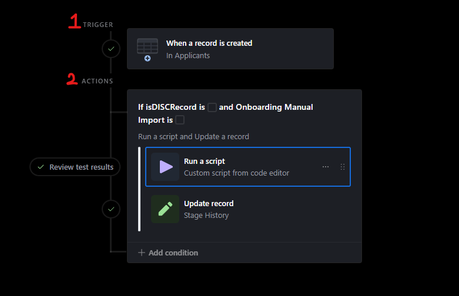
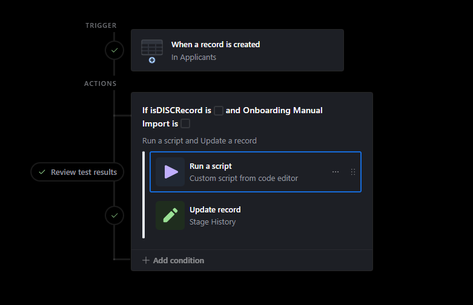
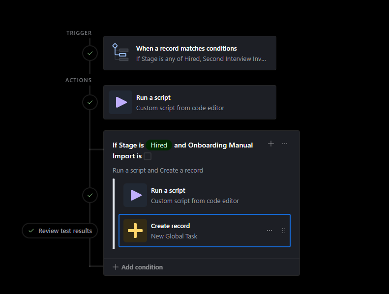
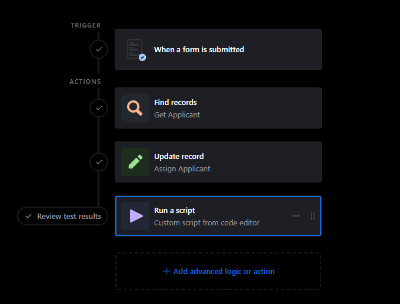
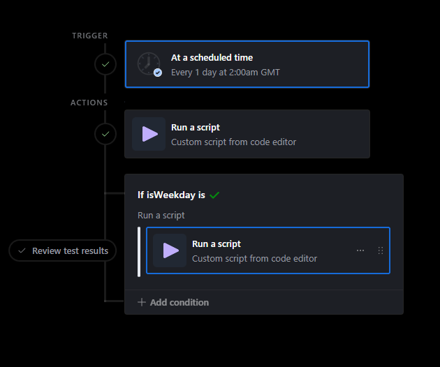
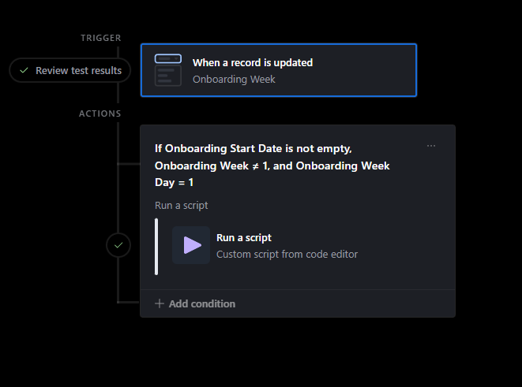

# Airtable Automations

_Last updated: February 2026_

This page documents all active Airtable automations. These automations run inside Airtable itself — they watch for record changes or form submissions and either update records directly or call out to Make.com to send emails.

> 

---

## How Airtable Automations Work

Airtable automations have two parts:
1. **Trigger** — what causes the automation to run (e.g. a record is created, a field changes, a form is submitted)
2. **Actions** — what happens when it runs (update a record, run a script, send a notification)

Many automations here use a **"Run a script"** action to call a Make.com webhook. This is how Airtable and Make.com communicate — the script packages up the relevant data and POSTs it to a webhook URL.

> 

---

## Hiring Automations (Change Stage Group)

These 5 automations manage the hiring pipeline.
---

### 1. New Applicant

| | |
|---|---|
| **Trigger** | A new record is created in the **Applicants** table |
| **Condition** | Only runs if the **Onboarding Manual Import** checkbox is **unchecked** |

**What it does:**
1. Runs a script that sends the applicant's data to the `NEW_APPLICANT` Make.com scenario (via webhook). Make.com sends a "Thank you for applying" confirmation email to the candidate and updates the applicant record with interviewer assignments and sets stage to "Application Confirmation"
2. Updates the **Stage History** field on the applicant record to:
```json
[{ "stage": "New Application", "at": "" }]
```

**Why the condition matters:** If you manually add an existing staff member to Airtable (checking "Onboarding Manual Import"), this automation is skipped — no confirmation email is sent and the stage history starts blank.

> 

---

### 2. Changes in Stage

| | |
|---|---|
| **Trigger** | A record in the **Applicants** table matches conditions: **Stage** field is any of `Rejected`, `Hired`, `Second Interview Invite Sent`, `Rejected - Liked` |

**What it does:**

**Step 1 — Always runs:**
Fires the `CHANGES_IN_STATUS` Make.com scenario with the candidate's data. Make.com routes based on the stage:
- **Hired** → sends a welcome email with Welcome PDF + New Starter form attachments, then emails managers@smilecliniq.com to set the start date
- **Second Interview Invite Sent** → builds a personalised Cal.com second interview link and sends the invite email
- **Rejected** → sends a rejection email to the candidate (Subject: "Smile Cliniq Application Update")
- **Rejected - Liked** → sends a softer rejection email to the candidate (Subject: "Thank You for Your Application") — notes you'd like to keep their info on file for future roles

**Step 2 — Conditional (Hired only):**
If Stage = **Hired** AND **Onboarding Manual Import** is **unchecked**:
- Runs a script that calculates a **Due Date** (skipping weekends from today's date)
- Creates a new record in the **Tasks** table using this due date — this is the manager's task to set the onboarding start date

> 

---

### 3. Send First Interview Invite

| | |
|---|---|
| **Trigger** | A record in the **Applicants** table changes: **Stage** field changes to `First Interview Invite Sent` |

**What it does:**
1. Runs a script that collects the candidate's name, email, location, and assigned interviewer
2. Sends this payload to the `SEND_FIRST_INTERVIEW_INVITE` Make.com scenario
3. Make.com builds a personalised invite email with: the DISC assessment link, the candidate's personalised DISC upload form, and their Cal.com booking link (pre-filled with name, email, location slug)

**Prerequisite:** The **Interviewer** and **Interview Location** fields must be filled in on the applicant record before this stage is set. If the interviewer has no Cal.com link in the Staff table, the automation falls back to a generic booking URL.

> 

---

### 4. Feedback Submission

| | |
|---|---|
| **Trigger** | A form is submitted in the **Feedback** table |

**What it does:**

**If the Interview Stage input = "First Interview":**
- Updates the applicant's **Stage** to `Reviewed`

**If the Interview Stage input = "Second Interview":**
- Updates the applicant's **Stage** to `Reviewed (2nd)`
- Finds the existing First Interview feedback record for this applicant
- Merges the Second Interview feedback record with the First Interview record, creating a single combined feedback record for both rounds

This means by the end of the hiring process, each applicant has one consolidated feedback record rather than two separate ones.

> 

---

### 5. Document Submission

| | |
|---|---|
| **Trigger** | A form is submitted in the **Documents** table |

**What it does:**
1. Takes the email address from the submitted form
2. Searches the **Applicants** table for a record matching that email
3. Links the new Documents record to the matching applicant record (via the "Documents" linked field)
4. Triggers the `RECEIVED_JOB_DOCUMENTS` Make.com scenario via script — this processes the submitted documents and sends a confirmation

> 

---

## Onboarding Automations

Two automations handle the weekly task assignment cycle. Both call the same massive Make.com scenario: `ONBOARDING_TASK_ASSIGNEMENT`.
---

### 6. Send Week 1 Tasks

| | |
|---|---|
| **Trigger** | Scheduled time (runs automatically at a set interval) |

**What it does:**
Sends a simple payload to the `ONBOARDING_TASK_ASSIGNEMENT` Make.com scenario:
```json
{ "action": "assign.week_one" }
```
Make.com then processes all active onboardings and assigns the correct Week 1 tasks to each new hire.

> 

---

### 7. Week Change

| | |
|---|---|
| **Trigger** | The **Onboarding Week** field changes on any record in the Applicants table |
| **Condition** | All three must be true: Onboarding Start Date is not empty, Onboarding Week ≠ 1, Onboarding Week Day = 1 |

**What it does:**
When a hire's onboarding week increments (e.g. Week 1 → Week 2), and it's the first day of that new week, this automation fires the `ONBOARDING_TASK_ASSIGNEMENT` scenario. Make.com assigns the tasks for the new week to that hire.

The condition `Onboarding Week ≠ 1` prevents double-triggering on Week 1 (which is already handled by the "Send Week 1 Tasks" automation above).

> 

---

## Other Automations (Minor)

These automations handle housekeeping tasks. They are self-contained and do not call Make.com.

| Name | Group | What it does |
|---|---|---|
| **Un-claim Claimed Tasks** | Tasks | Scheduled — finds tasks that were claimed but not completed within a time limit and resets them |
| **End of Probation** | Onboarding | When a record matches probation end conditions, creates a completion record |
| **Set Overdue** | Onboarding | When a record matches conditions (task past due date), updates its status to Overdue |
| **Start Onboarding** | Onboarding | Button-triggered — when clicked, updates the applicant record to mark onboarding as started |
| **Custom Task** | Onboarding | When a custom task form is submitted, runs a script |
| **DISC PDF Record Merge** | Onboarding | When a DISC PDF form is submitted, updates the relevant record |

---

## Make.com Cross-Reference

Which Airtable automations call which Make.com scenarios:

| Airtable Automation | Make.com Scenario |
|---|---|
| New Applicant | [`NEW_APPLICANT`](https://eu2.make.com/340077/scenarios/789471/edit) |
| Changes in Stage | [`CHANGES_IN_STATUS`](https://eu2.make.com/340077/scenarios/789471/edit) |
| Send First Interview Invite | [`SEND_FIRST_INTERVIEW_INVITE`](https://eu2.make.com/340077/scenarios/964072/edit) |
| Document Submission | [`RECEIVED_JOB_DOCUMENTS`](https://eu2.make.com/340077/scenarios/1069841/edit) |
| Send Week 1 Tasks | [`ONBOARDING_TASK_ASSIGNEMENT`](https://eu2.make.com/340077/scenarios/5707892/edit) |
| Week Change | [`ONBOARDING_TASK_ASSIGNEMENT`](https://eu2.make.com/340077/scenarios/5707892/edit) |

For details on what each Make.com scenario does internally, see [Make.com Scenarios](automations).
