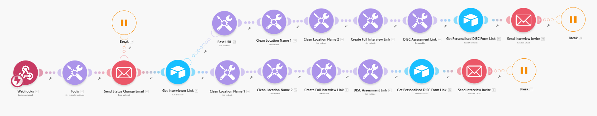
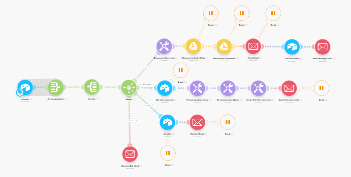
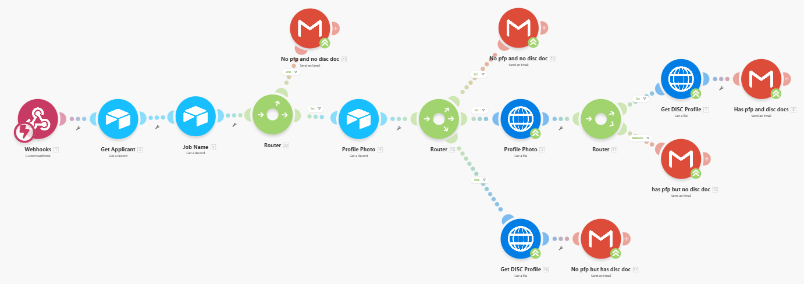
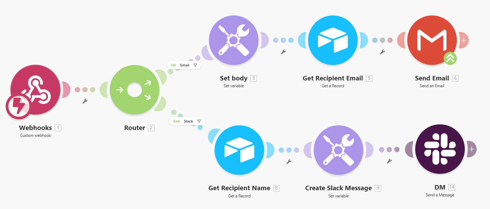

# Make.com Automations — Full Reference

> **Audience:** Developer maintaining or inheriting this project<br>
> **Last updated:** February 2026<br>
> **Blueprint files:** `docs/handover/automations/` (JSON exports for all 10 scenarios — 3 hiring + 7 onboarding)

This page documents every Make.com automation used by the Smile Cliniq platform — covering both the **hiring/ATS phase** (3 scenarios triggered by Airtable) and the **onboarding phase** (7 scenarios triggered by the web app). Each entry covers what triggers the scenario, exactly what it does step-by-step, what payload it expects, which email account sends the message, and how to test and debug it.

---

## Table of Contents

1. [Overview — All 10 Scenarios](#overview)

**Hiring Phase Scenarios (triggered by Airtable)**
- [H1 — New Applicant](#h1)
- [H2 — Send First Interview Invite](#h2)
- [H3 — Changes in Status (Stage Router)](#h3)

**Onboarding Scenarios (triggered by the web app)**
2. [Scenario 1 — Application Form Email](#scenario-1)
3. [Scenario 2 — Admin Invite Email](#scenario-2)
4. [Scenario 3 — Password Reset Email](#scenario-3)
5. [Scenario 4 — Onboarding Start Notification](#scenario-4)
6. [Scenario 5 — Task Assignment Notification](#scenario-5)
7. [Scenario 6 — General Notifications (Email + Slack)](#scenario-6)
8. [Scenario 7 — Custom Email](#scenario-7)

**Reference**
9. [Reconnecting After Account Migration](#reconnecting)
10. [Debugging a Broken Webhook](#debugging)

---

<a id="overview"></a>

## 1. Overview — All 10 Scenarios

### Hiring Phase Scenarios

These 3 scenarios are triggered by **Airtable automations** (not by the web app). They have no `MAKE_WEBHOOK_URL` environment variable — their webhook URLs are stored directly inside the Airtable automation scripts.

| # | Scenario Name | Blueprint File | Trigger Source | Sends |
|---|--------------|---------------|----------------|-------|
| H1 | New Applicant | `NEW_APPLICANT.json` | Airtable: "New Applicant" automation | Gmail (recruitment@smilecliniq.com) |
| H2 | Send First Interview Invite | `SEND_FIRST_INTERVIEW_INVITE.json` | Airtable: "Send First Interview Invite" automation | Gmail (recruitment@smilecliniq.com) |
| H3 | Changes in Status | `CHANGES_IN_STATUS.json` | Airtable: "Changes in Stage" automation | Gmail (recruitment@smilecliniq.com) |

> **Blueprint location:** `docs/handover/automations/applications/`

### Onboarding Scenarios

These 7 scenarios are triggered by the **Next.js web app** via environment variable webhook URLs.

| # | Scenario Name | Env Variable | Trigger Source | Sends |
|---|--------------|-------------|----------------|-------|
| 1 | Application Form Email | `MAKE_WEBHOOK_URL_NEW_APPLICATION_FORM` | Admin manually / external | Gmail (FlowFusion account) |
| 2 | Admin Invite Email | `MAKE_WEBHOOK_URL_ADMIN_PASSWORD_PAGE` | `api/admin/invite-admin` | Gmail (FlowFusion account) |
| 3 | Password Reset Email | `MAKE_WEBHOOK_URL_RESET_PASSWORD` | `api/forgot-password` | Gmail (recruitment@smilecliniq.com) |
| 4 | Onboarding Start Notification | `MAKE_WEBHOOK_URL_ONBOARDING_NOTIFICATION` | `api/admin/start-onboarding` | Email + Slack |
| 5 | Task Assignment Notification | `MAKE_WEBHOOK_URL_TASK_ASSIGNMENT` | Task assignment API | Gmail (recruitment@smilecliniq.com) |
| 6 | General Notifications | `MAKE_WEBHOOK_URL_NOTIFICATIONS` | `src/lib/notifications.js` | Email + Slack DM (per preferences) |
| 7 | Custom Email | `MAKE_WEBHOOK_URL_CUSTOM_EMAIL` | `api/admin/send-email` | Gmail (recruitment@smilecliniq.com) |

> **Email senders:** Two Google accounts are used across the onboarding scenarios. Scenarios 1–2 use a FlowFusion Gmail account (developer account, should be migrated). Scenarios 3, 5, 6, 7 and all hiring scenarios use `recruitment@smilecliniq.com` — the correct Smile Cliniq address.

---

---

## Hiring Phase Scenarios

These scenarios are triggered by Airtable automations, not by the web app. They handle the candidate journey from application through to being hired. Their webhook URLs are stored inside the Airtable automation scripts — see [Airtable Automations](airtable-automations) for the trigger side of each.

---

<a id="h1"></a>

## H1 — New Applicant

> **Blueprint file:** `docs/handover/automations/applications/NEW_APPLICANT.json`
> **Triggered by:** Airtable "New Applicant" automation (fires when a new record is created in the Applicants table and "Onboarding Manual Import" is unchecked)

### What it does

When a candidate submits the application form, Airtable creates a new record and fires this scenario. Make.com looks up the job being applied for, sends a confirmation email to the candidate, and updates the applicant record in Airtable with the assigned interviewers and email status.

### Step-by-step flow

```
1. Webhook (POST) → receives applicant data from Airtable:
   { name, email, jobId, recordId }
2. Airtable: Search Records → finds the Job record in Jobs table (tblSrLl0u8iWBmTRX)
   using the job ID from the payload
3. Router (by job type) → retrieves job title and assigned interviewers for that role
4. Gmail → sends "Thank you for your application" confirmation email to candidate
   From: recruitment@smilecliniq.com
5. Airtable: Update Record → updates the applicant record:
   - Sets "Interviewers" field (linked records)
   - Sets "Emails To Send" = "Application Confirmation"
6. Webhook responds 200
```

### Email details

| Field | Value |
|-------|-------|
| **From** | `recruitment@smilecliniq.com` |
| **To** | Candidate's email |
| **Subject** | `Thank you for your application at Smile Cliniq` |
| **Body** | Confirmation email acknowledging their application and setting expectations for next steps |

> **Note:** This scenario only fires for genuine new applications (Onboarding Manual Import unchecked). If a staff member is manually added to Airtable with the checkbox ticked, Airtable skips its "New Applicant" automation, so this Make.com scenario is never called.


---

<a id="h2"></a>

## H2 — Send First Interview Invite

> **Blueprint file:** `docs/handover/automations/applications/SEND_FIRST_INTERVIEW_INVITE.json`
> **Triggered by:** Airtable "Send First Interview Invite" automation (fires when Stage changes to "First Interview Invite Sent")

### What it does

Builds a personalised first interview invitation email. Fetches the interviewer's Cal.com booking link from the Staff table, fetches the candidate's personalised DISC PDF upload form link from the Applicants table, constructs a complete Cal.com booking URL with the branch location slug, and sends a 3-step invitation email to the candidate.

### Step-by-step flow

```
1. Webhook (POST) → receives from Airtable:
   { name, email, location, interviewerRecordId }
2. Airtable: Get Record → fetches interviewer from Staff table (tblfXqkA0Cna59UUk)
   → extracts "Cal Link - First Interview" field
3. Airtable: Get Record → fetches applicant from Applicants table
   → extracts "Personalised DISC Form Link" field
4. Set Variable "cal_link" → builds personalised booking URL:
   {interviewer_cal_link}/{location_slug}
   + query params: ?name={candidate_name}&email={candidate_email}
5. Gmail → sends 3-step interview invite email to candidate:
   Step 1: Complete DISC assessment at tonyrobbins.com/disc
   Step 2: Upload DISC PDF results via personalised Airtable form link
   Step 3: Book interview slot via Cal.com booking link
   From: recruitment@smilecliniq.com
6. Webhook responds 200
```

### Email details

| Field | Value |
|-------|-------|
| **From** | `recruitment@smilecliniq.com` |
| **To** | Candidate's email |
| **Subject** | First interview invitation (personalised with candidate name) |
| **Body** | Styled HTML email with 3 numbered steps: DISC assessment → PDF upload → Cal.com booking |

### Key data sources

| Data | Source |
|------|--------|
| Interviewer's Cal.com link | Staff table → "Cal Link - First Interview" field |
| Candidate's DISC upload form | Applicants table → "Personalised DISC Form Link" field |
| Branch location slug | Payload from Airtable ("Interview Location" field on applicant record) |

> **Prerequisite:** The **Interviewer** and **Interview Location** fields must be set on the Airtable applicant record before changing stage to "First Interview Invite Sent". If the interviewer has no Cal.com link in the Staff table, Make.com falls back to a generic booking URL.



---

<a id="h3"></a>

## H3 — Changes in Status (Stage Router)

> **Blueprint file:** `docs/handover/automations/applications/CHANGES_IN_STATUS.json`
> **Triggered by:** Airtable "Changes in Stage" automation (fires when Stage = Hired, Rejected, Second Interview Invite Sent, or Rejected - Liked)

### What it does

A routing scenario that handles multiple hiring stage changes. A Router module directs the flow into three branches based on the applicant's new stage: hired, second interview, or other (rejected/flagged).

### Step-by-step flow

```
1. Webhook (POST) → receives applicant data + new stage from Airtable
2. Aggregator + Feeder → prepares and structures the incoming data
3. Router (4 routes based on stage value):
   ├── Route A (Stage = "Hired"):
   │     a. Set Variable "docs_form_link" → builds personalised New Starter Document Form URL
   │     b. Google Drive: Get File → fetches "Welcome to Smile Cliniq" PDF (Shared Drive)
   │     c. Google Drive: Get File → fetches "SC New Employee Starter Forms" PDF (My Drive)
   │     d. Gmail → sends "You're hired!" email to candidate:
   │           Subject: "You're hired! Welcome to the Smile Cliniq Team"
   │           Attachments: both PDFs above
   │           Includes "New Starter Document Form Link" button
   │           From: recruitment@smilecliniq.com
   │     e. Airtable: Get Record → looks up job name from Jobs table
   │     f. Gmail → sends manager notification to managers@smilecliniq.com:
   │           Subject: "New Employee Hired - Action Required: {name}"
   │           Prompts managers to log into the platform and set the onboarding start date
   │
   ├── Route B (Stage = "Second Interview Invite Sent"):
   │     a. Airtable: Get Record → fetches interviewer from Staff table (tblfXqkA0Cna59UUk)
   │           → extracts "Cal Link - Second Interview" field
   │     b. Set Variable "location_name" → strips " Branch" suffix from location
   │     c. Set Variable "location_name" → lowercases and replaces spaces with "-"
   │     d. Set Variable "cal_link" → builds full booking URL:
   │           {cal_link_second_interview}-{location_slug}?name={name}&email={email}
   │     e. Gmail → sends second interview invite to candidate
   │           Subject: "Smile Cliniq Application Update"
   │           From: recruitment@smilecliniq.com
   │
   ├── Route C (Stage = "Rejected"):
   │     a. Airtable: Get Record → looks up job name from Jobs table (for email personalisation)
   │     b. Gmail → sends rejection email to candidate:
   │           Subject: "Smile Cliniq Application Update"
   │           Body: Standard rejection — thanks for applying, unable to proceed, explains
   │                 that high patient reviews, portfolios, and 4+ years experience are key factors
   │           From: recruitment@smilecliniq.com
   │
   └── Route D (Stage = "Rejected - Liked"):
         a. Gmail → sends softer rejection email directly to candidate:
            Subject: "Thank You for Your Application"
            Body: Notes they were genuinely impressed, would like to retain their
                  information on file for future opportunities
            From: recruitment@smilecliniq.com
```

### Email details

| Route | From | To | Subject |
|-------|------|----|----|
| Hired (candidate) | `recruitment@smilecliniq.com` | Candidate | "You're hired! Welcome to the Smile Cliniq Team" — with 2 PDF attachments + form link |
| Hired (manager) | `recruitment@smilecliniq.com` | `managers@smilecliniq.com` | "New Employee Hired - Action Required: {name}" — prompts to set onboarding start date |
| Second Interview Invite | `recruitment@smilecliniq.com` | Candidate | "Smile Cliniq Application Update" — Cal.com second interview booking link |
| Rejected | `recruitment@smilecliniq.com` | Candidate | "Smile Cliniq Application Update" — standard rejection, explains key selection criteria |
| Rejected - Liked | `recruitment@smilecliniq.com` | Candidate | "Thank You for Your Application" — softer rejection, notes candidate kept on file |

### Google Drive files (Hired route)

| File | Location |
|------|----------|
| "Welcome to Smile Cliniq" PDF | Google Shared Drive |
| "SC New Employee Starter Forms" PDF | Google My Drive |

> ⚠️ **Important:** If these Drive files are moved or renamed, the Google Drive module will break. Keep file names and locations consistent. If you need to replace a file, update the file ID in the Make.com scenario's Google Drive module.



---

## Onboarding Scenarios

These scenarios are triggered by the Next.js web app via environment variable webhook URLs stored in Vercel.

---

<a id="scenario-1"></a>

## 2. Scenario 1 — Application Form Email

> **Blueprint file:** `docs/handover/automations/NEW_APPLICATION_FORM.json` <br>
> **Webhook label in Make.com:** "Send New Application Form"

### What it does

This scenario sends an **email invitation** to prospective candidates with a personalised link to the Airtable application form. The link is pre-filled with the candidate's email address and the job role they are applying for.

> **Important:** This scenario does NOT receive form submissions. Airtable handles form submissions directly. This scenario only sends the application form link to candidates.

### Step-by-step flow

```
1. Webhook (POST) → receives { jobType, emails[] }
2. Set Variable "job" → maps jobType to Airtable record ID:
     Nurse       → recHkcTWJeDUpXkUD
     Receptionist→ recDnw49CqyQviakA
     Dentist     → recVNjrfAFDmx2UvZ
     Manager     → recRCDWzRRIud8NfV
3. Iterator (BasicFeeder) → loops over the emails[] array
4. For each email: send Gmail with Airtable form link (pre-filled job + email)
5. On success → Webhook responds 200
   On email error → Webhook responds 500
```

### Payload expected

```json
{
  "jobType": "Nurse",
  "emails": ["candidate@example.com", "another@example.com"]
}
```

`jobType` must be one of: `Nurse`, `Receptionist`, `Dentist`, `Manager`.

### Email details

| Field | Value |
|-------|-------|
| **From** | FlowFusion Gmail (sauravkc@flowfusionai.com) — *should be updated to clinic address* |
| **To** | Each address in `emails[]` |
| **Subject** | `Application Form for {jobType} – Smile Cliniq` |
| **Body** | HTML email with a "Submit your application" button linking to the Airtable form, pre-filled with job role and email |

The Airtable form URL follows this pattern:
```
https://airtable.com/appZ4QT8rXFlX6LrZ/pagVXLJWkx39hTvHF/form
  ?prefill_Applying+For={airtableRecordId}
  &prefill_Email={candidateEmail}
```


---

<a id="scenario-2"></a>

## 3. Scenario 2 — Admin Invite Email

> **Blueprint file:** `docs/handover/automations/ADMIN_INVITE_EMAIL.json`
> **Webhook label in Make.com:** "Send Admin Password Page Link"

### What it does

When an existing admin invites a new admin user via the "Invite Admin" form in the admin panel, this scenario sends a **branded invitation email** with a "Set Your Password" button. The link directs the invitee to a one-time password setup page.

### Step-by-step flow

```
1. Webhook (POST) → receives { email, name, inviteLink }
2. Gmail → sends branded HTML invitation email to {email}
3. On success → Webhook responds 200 with { success: true, messageId }
   On error → Webhook responds 500 with { success: false, error: "..." }
```

### Payload expected

```json
{
  "email": "newadmin@smilecliniq.com",
  "name": "Jane Smith",
  "inviteLink": "https://onboarding-task-manager.vercel.app/set-password?token=..."
}
```

### Email details

| Field | Value |
|-------|-------|
| **From** | FlowFusion Gmail (sauravkc@flowfusionai.com) — *should be updated to clinic address* |
| **To** | `email` from payload |
| **Subject** | `"You have been invited to join our platform as an admin!"`|
| **Body** | Styled HTML: blue header ("Admin Access Invitation"), personalised greeting using `name`, blue "Set Your Password" button linking to `inviteLink`, fallback plain-text link, security note that link may expire |

> **Known issue:** The email subject in the blueprint is still set to "testing" — this needs to be updated in the Make.com scenario editor directly.


---

<a id="scenario-3"></a>

## 4. Scenario 3 — Password Reset Email

> **Blueprint file:** `docs/handover/automations/PASSWORD_RESET_EMAIL.json`
> **Webhook label in Make.com:** "Onboarding: Reset Password"

### What it does

When a user submits the "Forgot Password" form, the Next.js app generates a signed JWT reset token and sends it to this scenario. Make.com builds the full reset URL and delivers a **password reset email** with an expiry notice.

### Step-by-step flow

```
1. Webhook (POST) → receives { email, resetToken, expiresIn }
2. Router checks:
   Route A — Invalid request (if email OR resetToken is missing):
     → Webhook responds 400: "Missing required parameters: email or resetToken"
   Route B — Valid request:
     a. Set Variable "base" = "https://onboarding-task-manager.vercel.app"
     b. Set Variable "url" = "{base}/reset-password?token={resetToken}"
     c. Regex parser: parses expiresIn (format: "30m", "2h", "1d") into number + unit
     d. Set Variable "time" = human-readable unit (s→second, m→minute, h→hour, d→day)
     e. Gmail → sends reset email with link and expiry info
     f. Webhook responds 200
```

### Payload expected

```json
{
  "email": "user@smilecliniq.com",
  "resetToken": "eyJhbGciOi...",
  "expiresIn": "30m"
}
```

`expiresIn` format: a number followed by a unit — `s` (seconds), `m` (minutes), `h` (hours), `d` (days). Example: `"30m"`, `"2h"`, `"1d"`.

### Email details

| Field | Value |
|-------|-------|
| **From** | `recruitment@smilecliniq.com` |
| **To** | `email` from payload |
| **Subject** | `SC- Password Reset` |
| **Body** | Styled HTML: purple gradient header ("Reset Your Password"), explanation that link expires in `{number} {unit}`, purple "Reset Password" button, note to ignore if they didn't request this |

### Security notes

- The reset token is a JWT signed with `JWT_SECRET` and contains a nonce stored in Airtable.
- The nonce is cleared from Airtable after the user successfully resets their password, making the link **single-use**.
- Make.com does not need to validate the token — it just delivers the email. Validation happens in the Next.js reset-password page.


---

<a id="scenario-4"></a>

## 5. Scenario 4 — Onboarding Start Notification

> **Blueprint file:** `docs/handover/automations/ONBOARDING_START_NOTIFICATION.json`
> **Webhook label in Make.com:** "New Onboarding Notification"

### What it does

When an admin triggers onboarding for a new hire (assigns their first batch of tasks), this scenario receives the applicant's Airtable record ID, **fetches the full applicant details from Airtable**, and sends notifications to relevant staff members informing them that a new hire's onboarding has begun.

### Step-by-step flow

```
1. Webhook (POST) → receives { recordID }
2. Airtable: Get Record → fetches applicant from "Applicants" table (table: tbl4ldFExsS5hWR3L)
   using recordID from the webhook payload
3. Looks up relevant staff to notify (from Airtable relationships)
4. Sends notification emails and/or Slack messages to those staff members
```

> **Note:** This is a complex scenario (312KB blueprint). The Airtable base used is `appZ4QT8rXFlX6LrZ` (Application Tracking System). The applicant table ID is `tbl4ldFExsS5hWR3L`.

### Payload expected

```json
{
  "recordID": "recXXXXXXXXXXXXXX"
}
```

`recordID` is the Airtable record ID of the applicant whose onboarding is starting.



---

<a id="scenario-5"></a>

## 6. Scenario 5 — Task Assignment Notification

> **Blueprint file:** `docs/handover/automations/TASK_ASSIGNMENT_NOTIFICATION.json`
> **Webhook label in Make.com:** "Onboarding - Assign Tasks"

### What it does

This is the most complex scenario (2.6MB blueprint). When an admin assigns onboarding tasks to a new hire, this scenario:
1. Looks up the applicant in Airtable
2. Creates task log records in Airtable for each assigned task (linking them to the applicant)
3. Sends an email to relevant recipients notifying them that tasks have been assigned

### Step-by-step flow

```
1. Webhook (POST) → receives task assignment payload
2. Set Variable "website_link" → stores the app base URL
3. Router splits into parallel processing paths:
   Path A:
     a. Search Airtable "Applicants" / "Onboarding" table for matching records
     b. Get applicant record details
     c. Search for existing task records
     d. Aggregate results
     e. Search for task templates
     f. Iterator → loop through tasks to assign
     g. Airtable: Create Record → create task log entry per task
     h. Aggregate created records
     i. Search + Router → conditionally update records
     j. Airtable: Update Records → mark assignments
   Path B (similar structure for a second group of tasks/recipients)
4. Gmail → send "New Tasks Have Been Assigned" email to recipient(s)
5. Webhook responds 200
```

### Email details

| Field | Value |
|-------|-------|
| **From** | `recruitment@smilecliniq.com` |
| **To** | Recipient email(s) from payload |
| **Subject** | `New Tasks Have Been Assigned` |
| **Body** | HTML notification listing assigned tasks (constructed from Airtable data) |


---

<a id="scenario-6"></a>

## 7. Scenario 6 — General Notifications (Email + Slack)

> **Blueprint file:** `docs/handover/automations/GENERAL_NOTIFICATIONS.json`
> **Webhook label in Make.com:** "Onboarding Notifications"

### What it does

This is the **central notification dispatcher**. Any in-app event that needs to notify a staff member (task completed, document uploaded, quiz submitted, etc.) is routed through this scenario. Based on the `channels` array in the payload, it routes the notification to email, Slack DM, or both.

The recipient is looked up in Airtable using their record ID — Make.com fetches their email and Slack ID to deliver the message.

### Step-by-step flow

```
1. Webhook (POST) → receives { channels, type, severity, title, body, recipientId }
2. Router:
   Route A — Email (if "Email" is in channels[]):
     a. Set Variable "body" = formatted HTML body: "Type: X, Severity: Y, Detail: Z"
     b. Airtable: Get Record → fetch Staff record using recipientId
        (table: tblfXqkA0Cna59UUk = Staff table)
     c. Gmail → send email to Staff.Email with subject = title, body = formatted body
   Route B — Slack (if "Slack" is in channels[]):
     a. Airtable: Get Record → fetch Staff record using recipientId
     b. Set Variable "slack_message" → build Slack Block Kit JSON:
          { header: "🔔 Notification for {Name}",
            fields: [Type, Level, Title, Detail] }
     c. Slack: Create Message (DM) → send to Staff.Slack ID
        (via "Recruitment Bot" on smilecliniq.slack.com)
```

> **Dual-channel behaviour:** A single webhook call can trigger BOTH an email and a Slack DM if the `channels` array contains both values. The two routes run in parallel.

### Payload expected

```json
{
  "channels": ["Email", "Slack"],
  "type": "task_completed",
  "severity": "info",
  "title": "Task Completed: DBS Check",
  "body": "Jane Smith has completed the DBS Check task.",
  "recipientId": "recXXXXXXXXXXXXXX"
}
```

| Field | Type | Description |
|-------|------|-------------|
| `channels` | `string[]` | Delivery channels. Accepted values: `"Email"`, `"Slack"` |
| `type` | `string` | Event type (e.g. `task_completed`, `document_uploaded`) |
| `severity` | `string` | Severity level (e.g. `info`, `warning`, `error`) |
| `title` | `string` | Short notification title — used as the email subject |
| `body` | `string` | Notification detail text |
| `recipientId` | `string` | Airtable record ID from the Staff table |

### Connections used

| Connection | Account |
|-----------|---------|
| Email | `recruitment@smilecliniq.com` via Google/Gmail |
| Slack | Recruitment Bot (`smilecliniq.slack.com` workspace, `recruitment_bot`) |
| Airtable | Smile Cliniq - ATS (`appZ4QT8rXFlX6LrZ`) |

### How notification preferences work

The `channels` array is built by `src/lib/notifications.js` in the app. It reads the recipient's `Notification Channels` field from the Staff Airtable table, which is a multi-select of `["Email", "Slack"]`. Only the channels the staff member has opted into are included in the webhook payload — Make.com does not check preferences itself.



---

<a id="scenario-7"></a>

## 8. Scenario 7 — Custom Email

> **Blueprint file:** `docs/handover/automations/CUSTOM_EMAIL.json`
> **Webhook label in Make.com:** "Send New Hire Email Notifications"

### What it does

When an admin uses the "Send Email" feature in the admin panel to compose and send a custom email to one or more recipients, this scenario delivers the email. It accepts a pre-written subject and body, performs newline-to-HTML conversion, and sends to all recipients in a loop.

### Step-by-step flow

```
1. Webhook (POST) → receives { email: { subject, body }, recipients: [{ email }] }
2. Regex Replace → replaces all "\n" with "<br>" in body (converts plain text to HTML)
3. Iterator (BasicFeeder) → loops over recipients[]
4. For each recipient:
   Gmail → send email with:
     - subject = email.subject (from payload)
     - body = HTML-converted body
5. On success → Webhook responds 200 with { success: true, messageId }
   On email error → Webhook responds 500 with { success: false, error: "..." }
```

### Payload expected

```json
{
  "email": {
    "subject": "Welcome to Smile Cliniq — Important Documents Needed",
    "body": "Hi,\n\nPlease upload your DBS certificate by Friday.\n\nThanks,\nSmile Cliniq"
  },
  "recipients": [
    { "email": "newhire@example.com" },
    { "email": "another@example.com" }
  ]
}
```

### Email details

| Field | Value |
|-------|-------|
| **From** | `recruitment@smilecliniq.com` |
| **To** | Each address in `recipients[]` (sent individually, not as a group) |
| **Subject** | `email.subject` from payload |
| **Body** | `email.body` from payload, with `\n` replaced by `<br>` for HTML rendering |

> **Note on newlines:** The admin enters the email body as plain text in the admin panel UI. Make.com converts line breaks to `<br>` HTML tags before sending. This is why the email renders correctly in email clients even though it was typed as plain text.


---

<a id="reconnecting"></a>

## 9. Reconnecting After Account Migration

If Make.com scenarios are migrated to a new account, or any connected service (Gmail, Airtable, Slack) needs to be reconnected, follow these steps.

### Re-importing a blueprint

1. Log in to [make.com](https://make.com)
2. Go to your organisation → **Scenarios**
3. Click **"Create a new scenario"**
4. In the scenario editor, click the **three-dot menu** (top right) → **"Import blueprint"**
5. Upload the relevant JSON file from `docs/handover/automations/`
6. After import, reconnect all services (see below)
7. Copy the new webhook URL and update the corresponding env variable in Vercel
8. Activate the scenario (toggle at the top of the editor)

### Reconnecting Gmail

Each scenario that sends email uses a Google account connection. After migration:
1. Open the Gmail module in the scenario
2. Click the **Connection** field → **"Add"** or select existing
3. Authenticate with the correct Google account
4. Repeat for all Gmail modules in the scenario

**Which account to use:**
- Scenarios 1, 2: Any Gmail (currently uses developer account — consider migrating to `recruitment@smilecliniq.com`)
- Scenarios 3, 5, 6, 7 and all Hiring scenarios (H1, H2, H3): `recruitment@smilecliniq.com`

### Reconnecting Airtable

Scenarios 4, 5, 6 and all Hiring scenarios (H1, H2, H3) query Airtable directly:
1. Open any Airtable module
2. Click **Connection** → authenticate with the Smile Cliniq Airtable account
3. Verify the **Base** is set to `Application Tracking System` (ID: `appZ4QT8rXFlX6LrZ`)
4. Verify the **Table** selections match what's documented above

### Reconnecting Slack

Scenario 6 uses the Slack "Recruitment Bot":
1. Open the Slack module
2. Click **Connection** → select or add the `smilecliniq.slack.com` workspace connection
3. The bot must be installed in the workspace as `recruitment_bot`
4. Verify the Slack user IDs in Staff records are correct (`Slack ID` field in Airtable Staff table)

### Verifying all scenarios are active

1. Log in to Make.com → Scenarios
2. Confirm all 10 scenarios are listed and **active** (green toggle)
3. Check **Last run** — all should have run recently if the app is in use
4. Any scenario showing **"Error"** needs investigation — click through to see the error detail

---

<a id="debugging"></a>

## 10. Debugging a Broken Webhook

Use this checklist when a Make.com automation stops working.

### Step 1 — Is the scenario active?

In Make.com → Scenarios, check the toggle next to the scenario. If it's grey/off, turn it on.

### Step 2 — Check Make.com execution history

1. Open the scenario
2. Click the **clock icon** (execution history) in the top toolbar
3. Find the failed run and click it
4. Inspect each module's input and output — Make.com shows exactly what data each step received and returned

### Step 3 — Check Vercel function logs

1. Go to [vercel.com](https://vercel.com) → your project → **Logs**
2. Filter by the relevant API route (e.g. `/api/admin/invite-admin`)
3. Look for `fetch` errors or non-200 responses from Make.com

### Step 4 — Verify the environment variable

1. Vercel → Project → Settings → **Environment Variables**
2. Find the relevant `MAKE_WEBHOOK_URL_*` variable
3. Check it has no trailing spaces, starts with `https://`, and is the current URL (Make.com generates a new URL if you delete and recreate a webhook)

### Step 5 — Test the webhook directly

Use a tool like curl or Postman to POST to the webhook URL directly with a test payload:

```bash
curl -X POST "https://hook.eu2.make.com/your-webhook-id" \
  -H "Content-Type: application/json" \
  -d '{ "email": "test@example.com", "name": "Test User", "inviteLink": "https://example.com" }'
```

This bypasses the Next.js app and tests Make.com in isolation.

### Common issues

| Symptom | Likely cause | Fix |
|---------|-------------|-----|
| Scenario not running at all | Scenario is off, or webhook URL changed | Check scenario is active; check env var |
| 400 error from Make.com | Missing required field in payload | Check the payload structure in the API route code |
| 500 error from Make.com | Email delivery failed | Check Gmail connection in Make.com; check quota |
| Email not arriving | Spam filter, wrong "From" account | Check spam; verify Gmail connection; check "To" address |
| Slack DM not arriving | Bot not in workspace, wrong Slack ID | Verify Slack connection; check `Slack ID` field in Staff Airtable record |

---

*For the overall system architecture, see [Technical Overview](technical-overview). For day-to-day staff guidance, see [Staff Operations Guide](operations-manual).*
